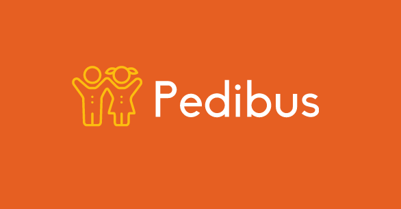

# Pedibus - Progetto Applicazioni Internet 18/19

## Sommario
- Requisiti di Progetto [PDF](stuff/requirements/AI19_Pedibus.pdf) - [MD](stuff/requirements/README.md)
- [Backend](backend): progetto Spring (IntelliJ)
- [Frontend](frontend): progetto Angular (Webstorm)

## Accorgimenti
Nel branch `master` di questa cartella cerchiamo di inserire solo codice **funzionante**, **testato** e soprattutto **commentato** adeguatamente.
