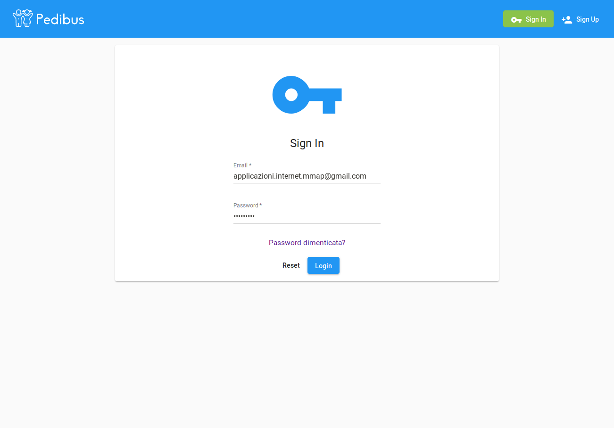
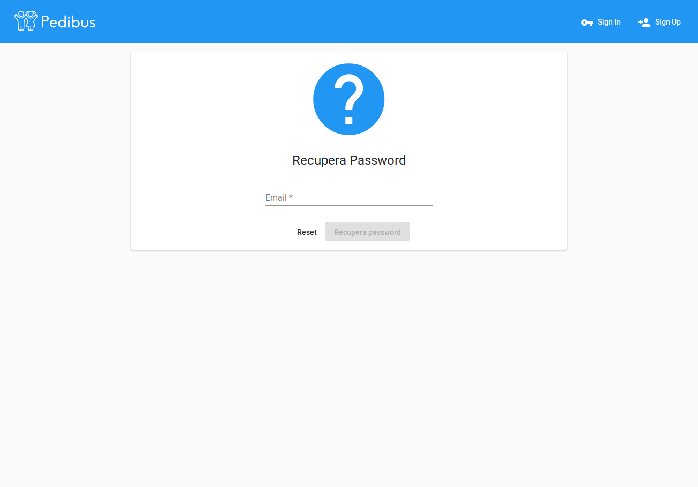
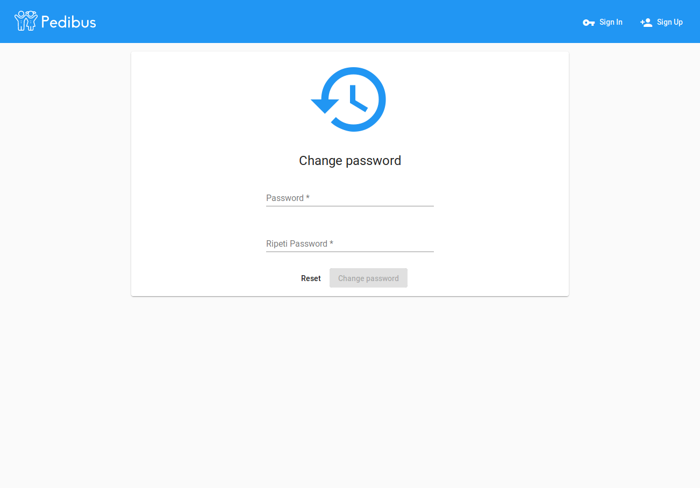
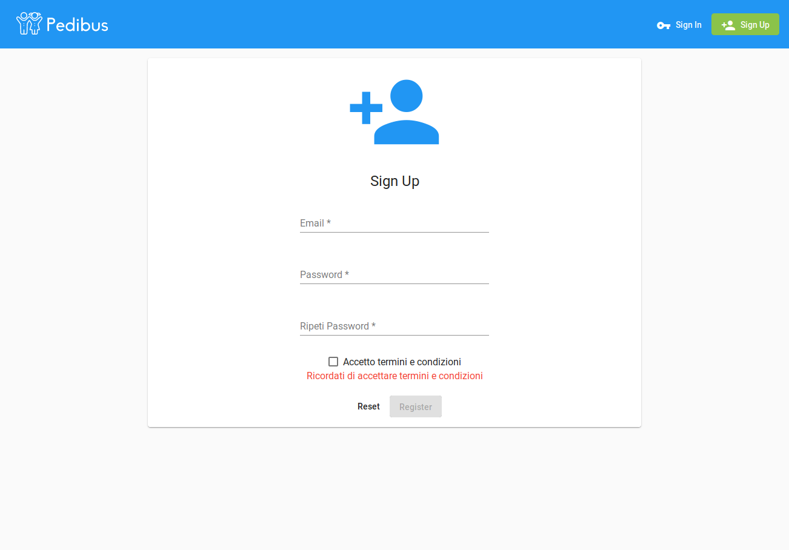
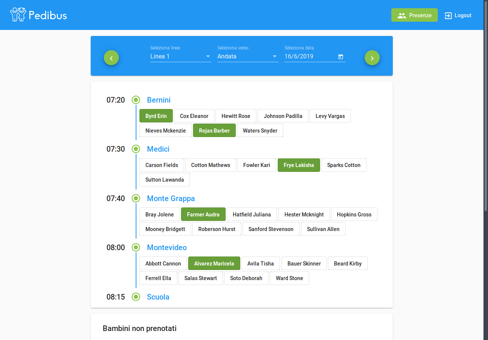
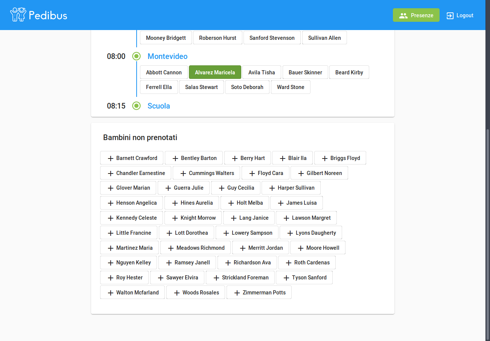
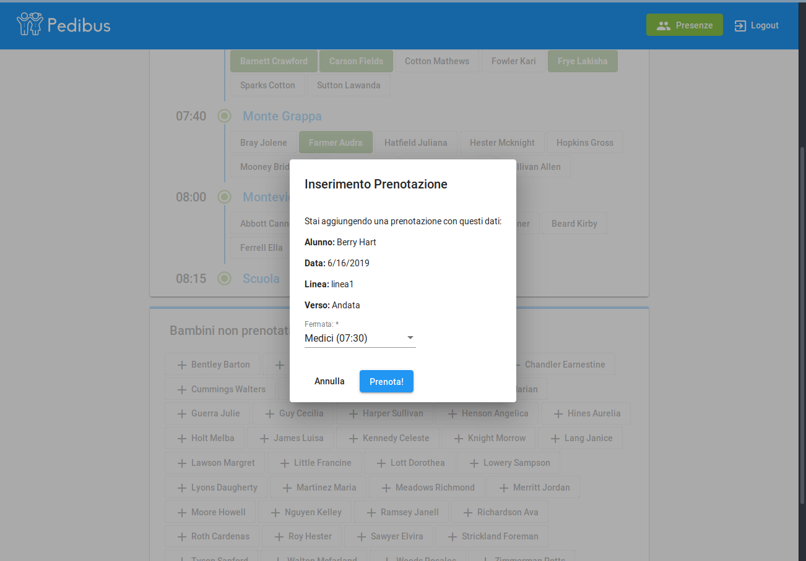
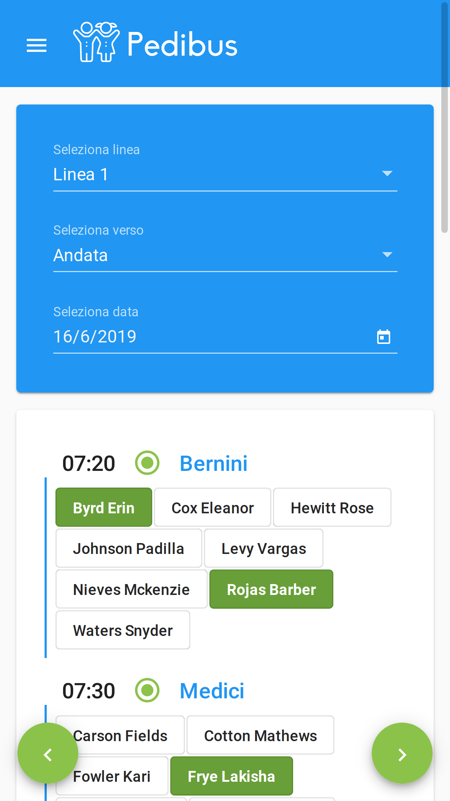
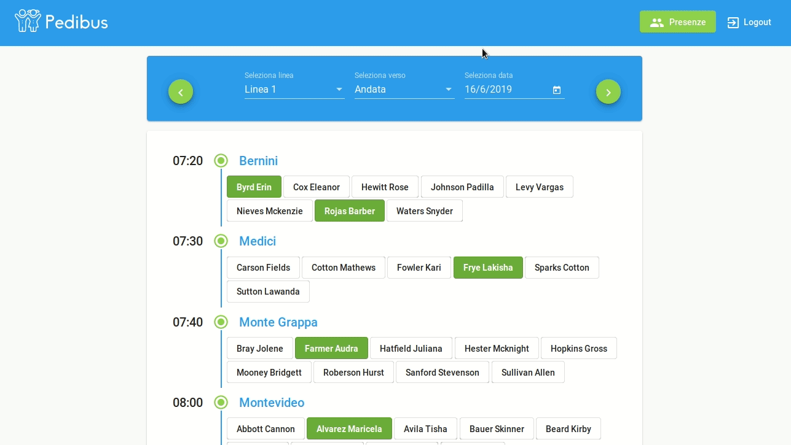

# Esercitazione 5

## Composizione Gruppo

Il gruppo MMAP è composto da:
- **Marco Florian** - s247030
- **Piero Macaluso** - s252894
- **Marco Nanci** - s255089
- **Angelo Turco** - s255270

## Mappe
Per poter andare a utilizzare le mappe all'interno dell'applicazione sarà necessario andare a inserire il proprio token API di Google Maps. Dopo averlo ottenuto sarà necessario andarlo a inserire in `app.module.ts` nell'applicazione angular di frontend, sostituendolo al placeholder `{API_TOKEN_GMAPS}`.

```ts
...
AgmCoreModule.forRoot({
      apiKey: '{API_TOKEN_GMAPS}'
    }),
...
```

## Avvio Applicazione con Docker
Dopo aver scompattato l'archivio `mmap-lab05-v1.zip`, posizionarsi da terminale nella cartella `mmap-lab05-v1` e seguire le seguenti istruzioni.
### Build Backend

1. Posizionarsi da terminale all'interno della cartella `backend`.
2. Avviare il comando `./mvnw clean install -Pprod -Dmaven.test.skip=true` o `mvn clean install -Pprod -Dmaven.test.skip=true`

### Build Frontend

1. Posizionarsi da terminale all'interno della cartella `frontend`.
2. Avviare il comando `npm install`
3. Avviare il comando `ng build --prod`

## Docker Compose-Up
1. Posizionarsi da terminale all'interno della cartella `mmap-lab05-v1` (dove si trova il `docker-compose.yml`)
2. Avviare il comando `docker-compose up --build`
3. Aprire il browser e dirigersi su `http://localhost:4200`

`http://localhost:4200` è valido solo su Mac, Linux e Windows non Home. Se si possiede Windows Home il link potrebbe cambiare (e.g. `http://192.168.99.100:4200`).

## Dati di prova

In questa esercitazione ad ogni avvio vengono inseriti dei dati fittizi che andranno a popolare la data corrente (che corrisponde all'avvio di Spring), 
e i due giorni successivi.

Ad esempio se l'esercitazione viene avviata in data 17/06/2019, le prenotazioni e le linee disponibili saranno popolate nelle date 17-18-19/06/2019.

## Utilizzo dell'app

### Header
Nell'header è presente il logo principale e il menù principale. Questo menù viene collassato in un Drawer Menu su dispositivi mobili con schermo ridotto.
Se non si è loggati si può accedere soltanto alle pagine di **Sign-Up** e  **Sign-In**, mentre se l'accesso è stato effettuato avremo **Presenze** e **Log-Out**
fra le scelte.

### Sign-In (`http://localhost:4200/sign-in`)
In questa schermata è possibile accedere inserendo le proprie credenziali. Se la richiesta di Login è positiva si viene reindirizzati verso la pagina delle presenze.



### Richiesta Cambio Password (`http://localhost:4200/recover`)
In questa schermata è possibile chiedere il cambio delle credenziali.




### Cambio Password (`http://localhost:4200/recover/{idToken}`)
Una volta ricevuta la mail di cambio password, in questa schermata è possibile procedere con il cambio delle credenziali.




### Sign-Up (`http://localhost:4200/sign-up`)
In questa schermata è possibile registrarsi inserendo mail e password (due volte). L'inserimento della mail scatena richieste al server per verificare se questa
non sia già presente nel database. Una volta ricevuta la conferma che la richiesta di registrazione è andata a buon fine la pagina mostra una conferma e un invito
a controllare la propria casella di posta elettronica.



### Conferma Password (`http://localhost:4200/confirm/{idToken}`)
Una volta ricevuta la mail di conferma, questa schermata serve a confermare la propria iscrizione.

### Interfaccia Presenze (`http://localhost:4200/presenze`)

Nella parte alta della schermata principale è possibile selezionare linea (Linea 1, Linea 2), verso (Andata, Ritorno) e data per visualizzare i dettagli di una linea.
Sono disponibili anche due frecce per cambiare giorno velocemente.

### Prenotazioni e Presenze
Nel corpo centrale dell'app vengono mostrate le fermate con l'elenco alfabetico degli alunni prenotati e, in fondo, quello degli alunni non prenotati. 
Gli alunni prenotati potranno essere contrassegnati come presenti premendo sul loro nome. Il pulsante bianco indica un alunno prenotato di cui non è stata confermata la presenza, mentre il pulsante color verde acqua rappresenta un alunno con presenza alla fermata confermata.

Per quanto riguarda gli alunni non Prenotati, l'accompagnatore potrà cliccare sul bottone di riferimento. Verrà visualizzata una finestra di dialogo attraverso cui
l'accompagnatore potrà verificare la nuova prenotazione, inserire la fermata e confermare. Una volta concluso l'alunno verrà contrassegnato come presente alla fermata
indicata e rimosso dalla lista dei non prenotati.

Il meccanismo di aggiornamento è stato implementato con l'utilizzo di WebSocketMessageBroker per poter inviare le modifiche in tempo reale a tutti gli utenti che stanno visualizzando la stessa pagina presenze.







Esempio schermata da Mobile



## I ruoli

All'interno della nostra applicazioni abbiamo 3 ruoli principali:

- **ROLE_USER**: proprio di un utente base, può solo visualizzare la finestra delle presenze e vederne i mutamenti.
- **ROLE_ADMIN**: proprio di un utente amministratore di Linea, per le linee di cui ha questo ruolo può aggiungere prenotazioni per i bambini non presenti e segnare come presi in carico i bambini, tutto ciò solo nel giorno odierno.
- **ROLE_SYS-ADMIN**: proprio dell'utente amministratore di sistema, può fare tutto.

Ecco alcuni utenti utili per testare le funzionalità:

##### ROLE_SYS-ADMIN
**email**: applicazioni.internet.mmap@gmail.com

**password**: `12345@Sys`

##### ROLE_ADMIN e ROLE_USER
La password è sempre  `1!qwerty1!`

50 genitori con ROLE_USER, ad es:  
(genitori.json)
- miles.reilly@test.it
- enid.crawford@test.it
- morales.holloway@test.it
  
25 nonni con ROLE_ADMIN, linea1:  
(nonni_linea1.json)  
- reed.snyder@test.it
- alexandra.winters@test.it
- briana.butler@test.it

25 nonni con ROLE_ADMIN, linea2:  
(nonni_linea2.json)  
- mai.berg@test.it
- cooley.bradshaw@test.it
- juliet.salazar@test.it

### Esempio di utilizzo
In questa veloce GIF mostriamo l'utilizzo dell'applicazione.


