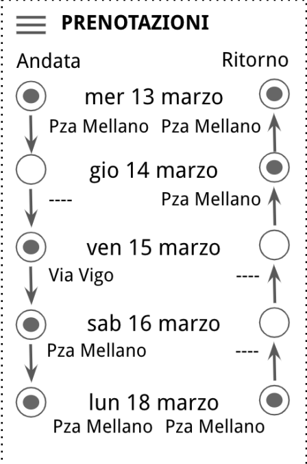
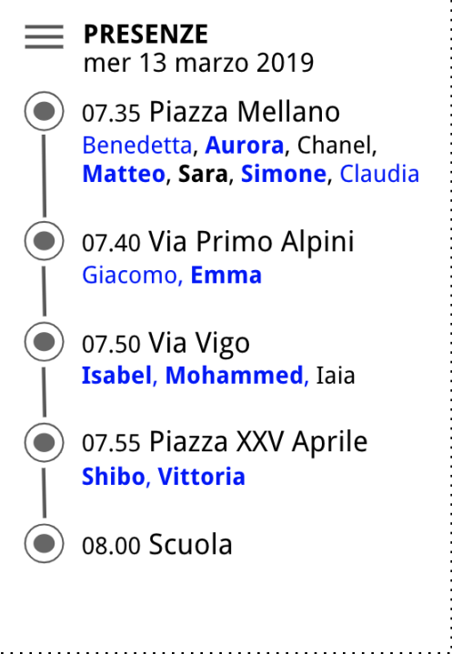

# Pedibus

#### Progetto Applicazioni Internet 2018/

## Indicazioni generali

- Sviluppo di un applicazione web basata su
    - Java Spring
    - Angular 2+
    - PostgreSQL/MongoDB
- Gruppi composti da massimo 4 persone
- Consegna su appuntamento preferibilmente in sessione esami
    - Necessaria comunicazione ai docenti con preavviso di almeno una settimana tramite
       email con oggetto: "Applicazioni Internet - Appuntamento x valutazione progetto"
    - Upload del codice sorgente nell’area elaborati del corso prima della consegna
    - Presenza di tutti i membri del gruppo (salvo giustificati motivi si accetta collegamento
       in videoconferenza)
- Gruppo di discussione: gruppo slack appinternet2019.slack.com, channel #progetto

## Descrizione

L’applicazione dovrà realizzare l’interfaccia ed il backend di un’applicazione web per la gestione di
una forma di trasporto scolastico denominata **Pedibus** [1]**.** Per Pedibus si intende sostanzialmente
l’accompagnamento a scuola a piedi dei bambini, generalmente delle elementari, da parte di
accompagnatori adulti. Gli accompagnatori “prelevano” e “consegnano” i bambini ai genitori
presso apposite fermate e insieme ai bambini percorrono un determinato tragitto per andare e
tornare da scuola.

Compito dell’applicazione è quello di fornire supporto alla gestione e organizzazione del pedibus
in particolare per i) gestire gli utenti e fornire loro informazioni, ii) tenere traccia dei bambini
“caricati” e “scaricati” dal pedibus, iii) raccogliere le disponibilità degli accompagnatori e
predisporre i turni di accompagnamento.

[1] https://it.wikipedia.org/wiki/Piedibus

## Dati

L’applicazione dovrà gestire i seguenti dati.

## Utenti

L’applicazione permetterà la registrazione ed il login degli utenti. Gli utenti si distinguono in
accompagnatori, gli adulti, e in passeggeri, i bambini. I bambini non si registrano in prima persona,
ma si registrerà per loro, con il loro nominativo, un genitore (che può avere più figli registrati). A
ciò si aggiunge la possibilità per uno o più accompagnatori di essere amministratori del sistema.
Compito esclusivo dell’amministratore è quello di definire (e cambiare) i turni del pedibus.
L’amministratore “master” è quello definito nel file della linea del pedibus. Gli amministratori

possono promuovere altri accompagnatori ad amministratori, o declassare gli amministratori a
semplici accompagnatori.

### Presenze

L’applicazione del pedibus viene utilizzata per tenere traccia della _salita_ e della _discesa_ dei
bambini dal pedibus stesso. È quindi necessario che gli accompagnatori possano registrare su di
essa in tempo reale la salita e discesa dei bambini. Tali informazioni devono essere sia
visualizzabili in tempo reale sia esportabili al di fuori dell’applicazione (in un file json, csv, etc.).
Per comodità la selezione dei bambini “presenti” viene fatta a partire dall’elenco dei bambini iscritti
dove quelli prenotati sono evidenziati per distinguerli dagli altri e individuarli più comodamente. È
comunque possibile segnare come presente un bambino, anche se non prenotato (nel caso i
genitori non l’avessero segnato per distrazione).

### Percorso o “linea”

Il percorso del pedibus è costituito da un certo numero di fermate disposte lungo un tragitto e
quindi ordinate (in un verso all’andata e nel verso opposto al ritorno). Le fermate hanno associato
un nome, un orario di riferimento (sia per l’andata sia per il ritorno), una posizione gps. Il percorso
può essere descritto in un file esterno e caricato dal sistema. L’applicativo caricherà tutti i percorsi
da gestire a partire da appositi file presenti in una cartella del sistema. Il nome del file
corrisponderà all’url della linea e nel file, oltre al percorso, sarà anche definito almeno un indirizzo
email dell’amministratore della linea.

### Corse

Le corse del pedibus sono a cadenza giornaliera, l’andata al mattino e il ritorno a pranzo o nel
pomeriggio. E’ necessario quindi gestire un elenco delle corse, ciascuna associata ad un giorno
dell’anno e con la distinzione tra andata e ritorno.

### Prenotazioni

Per migliorare la gestione del servizio pedibus (e non “dimenticarsi” nessuno per strada) è
necessario predisporre per ogni corsa del pedibus la possibilità di registrare chi vi prenderà parte.
Chiamiamo questa funzionalità “prenotazioni”. Il genitore, per ogni corsa del pedibus potrà
indicare se il figlio (o i figli) saranno presenti o no, e a partire da / fino a quale fermata. La
possibilità di aggiungere o rimuovere un bambino è possibile fino al passaggio del pedibus per
quella fermata.

### Disponibilità e turni

Per organizzare i turni degli accompagnatori è necessario definire e gestire due fasi distinte. La
prima in cui gli accompagnatori indicano la loro disponibilità per le corse del pedibus (giorno,
andata o ritorno) e la seconda in cui l’amministratore (o gli amministratori) del servizio selezionano
tra i disponibili gli accompagnatori che effettivamente verranno utilizzati, definendo quindi i turni di
ciascun accompagnatore per ciascuna corsa del pedibus. A fronte della definizione o della
modifica di un turno, le persone coinvolte vengono avvisate tramite un messaggio interno
all’applicazione del loro impegno.

## Viste

L’applicazione gestirà le seguenti schermate.

### Registrazione utente e login

La registrazione di un utente nel sistema è possibile solo agli amministratori i quali potranno
aggiungere l’indirizzo email dell’utente e definirne il ruolo. All’utente arriverà di conseguenza una
mail con un link per completare la registrazione del proprio profilo (es. password e altri dati).
All’atto della “creazione” di una nuova linea il sistema manderà analoga mail all’indirizzo definito
come amministratore della linea (se non già presente e amministratore della stessa). E’ anche
necessario definire una interfaccia per il login/logout dell’utente, tramite la password registrata.

### Interfaccia bambino: prenotazioni

Per gestire le prenotazioni il genitore ha a disposizione un elenco delle corse del pedibus (giorno e
andata/ritorno) e tramite un click potrà attivare o disattivare la prenotazione del bambino per
ciascuna corsa, per indicare se sarà presente o no. La prenotazione è modificabile soltanto entro il
passaggio del pedibus presso la fermata. Il bambino viene assegnato ad una fermata di default
configurata nel profilo, ma è possibile modificarla per ogni corsa.

### Interfaccia accompagnatore: presenze

Per gestire le presenze, gli amministratori avranno, per ogni corsa, una schermata con l’elenco di
tutti i bambini iscritti associati alla fermata prescelta dai loro genitori. Qui i bambini prenotati per
quella corsa saranno opportunamente evidenziati. Cliccando sul nome del bambino
l’accompagnatore può indicare la presa in carico (dal genitore, all’andata, o dalla scuola, al
ritorno). I nomi dei bambini, una volta presi in carico verranno opportunamente evidenziati (es.
cambiandone il colore del nome). Possono essere segnati come presenti anche bambini non
prenotati.

### Interfaccia accompagnatore: disponibilità

In modo analogo all’interfaccia “prenotazioni” del bambino, l’accompagnatore potrà indicare la
propria disponibilità per le varie corse (così come per le prenotazioni, la disponibilità non può
essere più cambiata dopo che l’amministratore ha “chiuso” i turni per quella corsa).
L’accompagnatore è di default disponibile dalla prima fermata della corsa all’andata e dalla scuola
al ritorno, ma anche lui può essere assegnato ad una fermata differente.

In tale interfaccia, dopo la definizione dei turni per ciascuna corsa, l’accompagnatore potrà
verificare se la propria disponibilità è stata utilizzata o no (cioè se è stato assegnato a quel turno),
ed eventualmente confermare la presa visione.

### Interfaccia amministratore: turni

In modo analogo all’interfaccia “presenze” l’amministratore potrà confermare per ogni corsa le
disponibilità di uno o più accompagnatori assegnandogli il turno su quella corsa. L’interfaccia dei
turni dovrebbe avere un pulsante “consolida turno” per ogni corsa del pedibus (o dei checkbox per
selezionare le corse e un pulsante generale per consolidare i turni delle corse selezionate) tramite
cui finalizzare il turno e inviare una comunicazione agli accompagnatori. (ovviamente il turno può
essere riaperto in caso siano necessarie modifiche)

Sempre tramite l’interfaccia turni, l’amministratore può trovare riscontro delle conferme degli
accompagnatori a cui sono stati affidate le corse del pedibus.

### Interfaccia: comunicazioni

In una apposita vista l’utente potrà visualizzare le comunicazioni a lui indirizzate. Ad esempio: i)
per l’amministratore, quando un accompagnatore ha confermato un turno, ii) per un
accompagnatore quando l’amministrazione ha consolidato il turno di una corsa del pedibus, iii) per

gli accompagnatori quando un bambino indica la sua presenza (o la rimuove) da una corsa del
pedibus.

In ogni vista dell’applicazione si predisponga una modalità con cui avvertire l’utente che è arrivata
una nuova comunicazione o che ci sono N comunicazioni ancora da leggere dall’ultima volta che
si è consultata la vista delle comunicazioni.

### Note

1. Ovviamente l’accesso alle varie funzionalità deve essere verificato e autorizzato in funzione
    dei ruoli di ciascun utente.
2. Ciascuna interfaccia, se visualizza dati che possono essere contemporaneamente
    modificati da altri utenti, deve essere in grado di aggiornarsi in tempo reale senza
    necessitare di un ricaricamento della stessa esplicito da parte dell’utente.

### Interfaccia REST

Il server deve esporre le funzionalità offerte al client attraverso una interfaccia REST utilizzabile
anche da applicazioni terze (es. dall’applicazione mobile).

## Valutazione

La valutazione terrà conto dei seguenti aspetti:

- Soddisfacimento delle specifiche e correttezza del funzionamento del sistema e gestione
    delle varie funzionalità
- Usabilità e funzionalità dell’interfaccia utente
- Ingegnerizzazione e scalabilità della implementazione proposta;
- Leggibilità del codice e documentazione tramite commenti
- Originalità ed efficacia nel raggiungimento degli obiettivi del progetto

